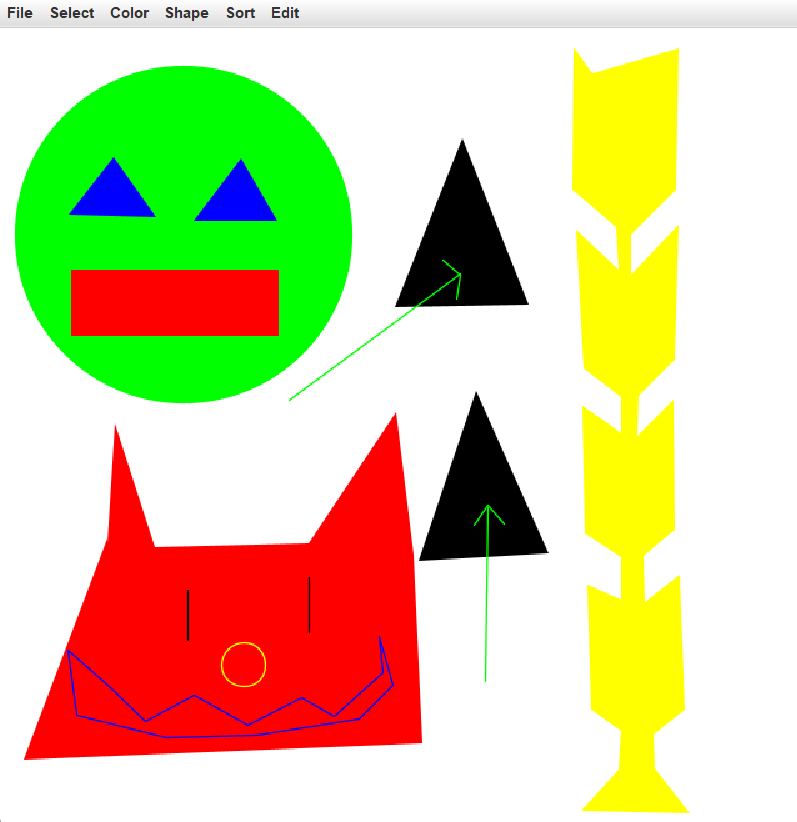

# Java Geometry Drawing

An interactive Java drawing application built around 2D geometry, shape transformations, collections, and file persistence.

Developed as part of an introductory Computer Science course. The assignment provided the drawing framework and several interfaces; my implementation focused on the geometry, algorithms, collection behavior, and application logic built on top of it.



## Features

- Circle, rectangle, triangle, polygon, segment, and point support
- Area, perimeter, and point-containment calculations
- Translation, scaling, and rotation
- Shape selection, coloring, copying, sorting, and removal
- Bounding-box calculation
- Saving and loading drawings from text files
- Interactive shape creation and manipulation
- JUnit tests for geometry and collection behavior

## Algorithms & Geometry

Key algorithms implemented include:

- **Shoelace formula** for polygon area
- **Ray-crossing** for point-in-polygon testing
- **Heron's formula** for triangle area
- Geometric **translation, scaling, and rotation**
- **Bounding-box calculation** and custom comparator-based sorting

## Project Structure

```text
src/drawing/
├── geo/       # Geometry and shape algorithms
├── gui/       # Drawing application and provided drawing backend
├── Main.java
├── GUIShape.java
└── ShapeCollection.java
```

## Running

Compile:

```bash
javac -d bin $(find src -name "*.java" ! -name "*Test.java")
```

Run:

```bash
java -cp bin drawing.Main
```

## Technologies

Java, OOP, interfaces and polymorphism, Java Collections, comparators, file I/O, JUnit, and 2D computational geometry.

## Provided Framework

The project was built within a university-provided framework. Several interfaces and parts of the GUI infrastructure were supplied as part of the assignment, and the drawing backend is based on Princeton's `StdDraw` library.